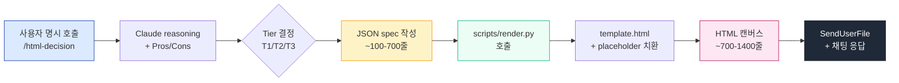

# html-decision

> **Claude Code 용 결정 캔버스 플러그인.** 사용자의 고민·결정사항을 HTML 결정 캔버스로 변환한다. 결정점 식별 → 옵션 도출 → Pros/Cons 비교 → 시각화 → MD 결과 회수.

**`/html-decision <고민>` 으로 명시 호출**. ★ 자동 발동 X (Claude 가 대화 문맥 보고 알아서 띄우는 일 없음).

[](https://github.com/yeonjun-cho/html-decision)
[](LICENSE)

---

## 🎨 풀세트 결정 캔버스 (단순 요약 X)

이건 *짧은 정리 HTML* 이 아니다. **8 결정점 + 옵션 별 Pros/Cons/예시 + Mermaid 의존 sequence + sticky sidebar + scroll-spy + visual progress + preview-panel + ack-area + localStorage + 3-format MD/JSON/prompt 출력** 까지 박는 **풀세트 결정 캔버스**. v1 (866줄 로컬 스킬) 의 visual polish 100% 흡수.

| 한 결정점 카드 안 박제 영역 |
|---|
| q-context (왜 결정 필요) · radio 옵션 N + 기타 (자동) · 옵션별 권장 표시 + reason 1줄 · `<details>` 안 Pros / Cons / 예시 · 코멘트 textarea (T2+) · preview-panel (옵션 영향 live table) |

| 전체 캔버스 박제 영역 |
|---|
| h1 underline + h2.phase top border · ack-area highlight · Mermaid flowchart (의존 sequence) · section-intro · sticky sidebar (260px) + 섹션 헤더 + visual progress bar + scroll-spy + "✓" answered marker · outline submit card + 다중 button (.gen/.action/.reset) · CSS class toast · localStorage 보존 |

---

## ⏱ 성능 — 케이스 별 실측 시간

평균 시간 절감은 유효하지만 **결정점 수 × detail 깊이 에 따라 선형 증가**. T3 상한 케이스 (8 결정점 + 풀 detail + preview ×2) 에서는 시간 절감이 작음.

| Tier | 결정점 N | Claude output | 예상 시간 (v0.4.x) | v0.3.x 대비 절감 |
|---|---|---|---|---|
| T1 | 1-3 | ~500-800 tokens | **15-25초** | ~85% ↓ |
| T2 | 4-7 | ~1500-2500 tokens | **40-70초** | ~70% ↓ |
| T3 표준 (5 결정점) | 5 | ~2500-3500 tokens | **1.5-2분** | ~50% ↓ |
| T3 헤비 (8 결정점, 풀 detail, preview×2) | 8+ | ~5000-7000 tokens | **3-4분** | ~10-20% ↓ |

★ v0.3.x = 모든 케이스 일관 3-4분 (HTML 직접 생성, ~9000 tokens). v0.4.x = 케이스 별로 갈림.

**진짜 bottleneck = Claude 가 JSON spec 작성하는 시간** (render.py 자체는 ~1초). 따라서 *결정 콘텐츠의 양* 이 시간을 결정. 콘텐츠 = 가치라 단순 축소는 권장 X.

### 더 줄이고 싶으면

- **결정점 5개로 압축** → -50%
- **옵션 detail 한 줄 reason 만** (Pros/Cons 생략) → -30%
- **preview-panel 생략** → -15%

원하는 깊이를 `/html-decision` 인자에 부연 가능: `"가볍게"`, `"풀세트"`, `"5결정점 이하"` 등.

---

## 🏗 아키텍처



**핵심 분리**:
- **Claude** = 결정 reasoning + 콘텐츠 (Pros/Cons, 권장 옵션, ack/flow context) 생성. **JSON spec 만 output**.
- **`render.py`** = 결정성 boilerplate (HTML 구조, CSS, JS, sidebar nav, output buttons) 렌더링. **server-side**.

Anthropic 공식 권장: ["Pre-made scripts save tokens (no need to include code in context), save time (no code generation required)"](https://platform.claude.com/docs/en/agents-and-tools/agent-skills/best-practices).

---

## 📦 설치

Claude Code 안 슬래시 커맨드로 한 번에 끝.

```text
/plugin marketplace add yeonjun-cho/html-decision
/plugin install html-decision@html-decision
```

확인:

```text
/plugin
```

`html-decision` 이 `installed` 로 보이면 끝.

요구 사항: `python3` (macOS/Linux 기본 설치).

---

## 🚀 쓰는 법

**오직 명시 호출만 동작.** Claude 가 대화 문맥 보고 알아서 띄우는 일 X.

```text
/html-decision 새 프로젝트 프론트엔드 스택 결정
```

또는 결정 깊이 지정:

```text
/html-decision 가볍게 — 회의 안건 3가지 중 1개 고르기
/html-decision 풀세트 — 17 결정 후 framework 적용 사전 확정 (8 영역)
```

### 결과 흐름

1. Claude 가 `.claude-history/html-decision/<YYYY-MM-DD-HH>-<topic>.html` 로 캔버스 저장
2. `SendUserFile` 로 파일 전달 — 브라우저에서 열어 옵션 선택
3. `[생성]` → `[복사]` → 채팅에 다시 붙여넣기
4. Claude 가 `<!-- html-decision-result -->` 매직 코멘트로 결과 인식 → 다음 단계 진행

---

## 🎯 Tier 분기 (자동 결정)

Tier 자체는 결정점 수와 복잡도에 따라 *자동* 으로 갈림 (자동 발동 X 와 별개 — 이미 명시 호출한 후의 내부 분기).

| Tier | trigger | 출력 features |
|---|---|---|
| **T1** | 결정점 1~3 + strategy 결정 X | radio + 기타 + MD 버튼. 코멘트 생략. 단순 layout |
| **T2** | 결정점 4~7 | T1 + 코멘트 textarea + 권장 옵션 강조 + MD/JSON 버튼 |
| **T3** | **결정점 ≥5 OR 의존 sequence OR strategy 결정 OR 선행 결정 ack** | T2 + sticky sidebar + scroll-spy + visual progress + Pros/Cons details + ack/flow/preview-panel + Mermaid + localStorage + 3-format (MD/JSON/prompt) |

자세한 동작 = [`skills/html-decision/SKILL.md`](skills/html-decision/SKILL.md).

---

## 📂 구조

```
html-decision/
├── .claude-plugin/
│   ├── plugin.json
│   └── marketplace.json
├── README.md
├── LICENSE
└── skills/
    └── html-decision/
        ├── SKILL.md           # process steps + Tier 분기 + JSON spec
        ├── scripts/
        │   ├── render.py      # JSON → HTML 렌더러 (Python 3.8+, stdlib only)
        │   └── template.html  # static scaffold (CSS + JS 박제)
        └── references/
            ├── content-rules.md   # 결정점 / 옵션 / Pros/Cons / context / ack / flow / preview 편집 룰
            └── output-formats.md  # MD/JSON/prompt paste-back parse rule
```

---

## 🔄 업데이트

```text
/plugin marketplace update html-decision
/plugin update html-decision@html-decision
```

---

## 🧠 설계 원칙 (Anthropic best practices 적용)

| 원칙 | 적용 |
|---|---|
| [Bundled scripts > generated code](https://platform.claude.com/docs/en/agents-and-tools/agent-skills/best-practices) | `scripts/render.py` 가 결정성 boilerplate 담당. Claude 는 JSON spec 만 |
| [Progressive disclosure](https://platform.claude.com/docs/en/agents-and-tools/agent-skills/best-practices) | SKILL.md → references (필요 시) → scripts (실행) |
| [Process in skill.md, context in references](https://www.mindstudio.ai/blog/claude-code-skills-architecture-skill-md-reference-files) | SKILL.md = 5-step process. content-rules.md = 편집 룰. template.html = 구조 |
| [One level deep references](https://platform.claude.com/docs/en/agents-and-tools/agent-skills/best-practices) | SKILL.md → references (직접). 중첩 X |
| [Plan-validate-execute](https://platform.claude.com/docs/en/agents-and-tools/agent-skills/best-practices) | JSON spec 가 plan. render.py 가 execute |

---

## 📝 라이선스

MIT

---

## 🙏 영감 / 출처

- [Anthropic Skill Authoring Best Practices](https://platform.claude.com/docs/en/agents-and-tools/agent-skills/best-practices) — bundled scripts, progressive disclosure
- [Anthropic Engineering: Agent Skills](https://www.anthropic.com/engineering/equipping-agents-for-the-real-world-with-agent-skills) — 4-layer architecture
- [MindStudio: Skill.md Architecture](https://www.mindstudio.ai/blog/claude-code-skills-architecture-skill-md-reference-files) — process vs context separation
- [MindStudio: 70% Token Cut Benchmark](https://www.mindstudio.ai/blog/5-claude-code-skills-cut-token-costs-70-percent-benchmarked)
- [lmmartinb: 80% Token Reduction](https://lmmartinb.com/en/claude-code-token-optimization/)
