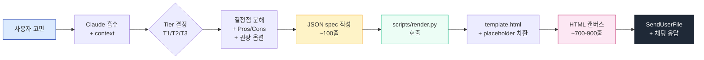

# html-decision

> **Claude Code 용 결정 캔버스 플러그인.** 사용자의 고민·결정사항을 HTML 결정 캔버스로 변환한다. 결정점 식별 → 옵션 도출 → Pros/Cons 비교 → 시각화 → MD 결과 회수.

"고민이다", "결정 도와줘", "어떻게 할지 모르겠어" 같은 발화가 나오거나 결정점이 2개 이상 보이면 자동 발동. `/html-decision <고민>` 으로 직접 부를 수도 있다.

[](https://github.com/yeonjun-cho/html-decision)
[](LICENSE)

---

## ⚡ v0.4.0 — 85% 시간 절감

Anthropic 공식 권장 패턴 ["bundled scripts > generated code"](https://platform.claude.com/docs/en/agents-and-tools/agent-skills/best-practices) 를 적용해서 캔버스 1개 생성 시간을 **3-4분 → 25-40초** 로 단축.

| 항목 | v0.3.x (이전) | **v0.4.0 (현재)** |
|---|---|---|
| 생성 시간 | 3-4 분 | **25-40 초** |
| Claude output 토큰 | ~9000 tokens | **~1000 tokens** |
| Claude 가 직접 출력 | 풀 HTML (~900줄) | **JSON spec (~100줄)** |
| HTML 렌더링 | Claude 가 매번 생성 | **`scripts/render.py` 가 server-side 렌더** |
| 의존 | X | python3 (macOS/Linux 기본 설치) |
| 디자인 품질 | 동일 | **동일** (template 박제) |

> *"Pre-made scripts are more reliable than generated code. **Save tokens (no need to include code in context). Save time (no code generation required).** Ensure consistency across uses."*
> — [Anthropic Skill Authoring Best Practices](https://platform.claude.com/docs/en/agents-and-tools/agent-skills/best-practices)

---

## 🏗 아키텍처



**핵심 분리**:
- **Claude** = 결정 reasoning + 콘텐츠 (Pros/Cons, 권장 옵션, ack/flow context) 생성. JSON spec 만 output.
- **`render.py`** = 결정성 boilerplate (HTML 구조, CSS, JS, sidebar nav, output buttons) 렌더링. server-side.

---

## 📦 설치

Claude Code 안 슬래시 커맨드로 한 번에 끝.

```text
/plugin marketplace add yeonjun-cho/html-decision
/plugin install html-decision@html-decision
```

확인:

```text
/plugin
```

`html-decision` 이 `installed` 로 보이면 끝.

요구 사항: `python3` (macOS/Linux 기본 설치).

---

## 🚀 쓰는 법

### 1) 자동 발동

대화 중 결정 고민이 보이면 Claude 가 알아서 스킬 띄움.

```
사용자: 새 프로젝트 스택 고르는 거 고민이다. Next vs Remix vs Astro 어떻게 할지...
Claude: [/html-decision 자동 호출 → JSON spec → render.py → HTML → 파일 전달]
```

### 2) 명시 호출

```
/html-decision 새 프로젝트 프론트엔드 스택 결정
```

### 3) 결과 흐름

1. Claude 가 `.claude-history/html-decision/<YYYY-MM-DD-HH>-<topic>.html` 로 캔버스 저장
2. `SendUserFile` 로 파일 전달 — 브라우저에서 열어 옵션 선택
3. `[생성]` → `[복사]` → 채팅에 다시 붙여넣기
4. Claude 가 `<!-- html-decision-result -->` 매직 코멘트로 결과 인식 → 다음 단계 진행

---

## 🎯 Tier 분기 (자동 결정)

결정점 개수와 복잡도에 따라 자동으로 Tier 갈림.

| Tier | trigger | 출력 features |
|---|---|---|
| **T1** | 결정점 1~3 + strategy 결정 X | radio + 기타 + MD 버튼. 코멘트 생략. 단순 layout |
| **T2** | 결정점 4~7 | T1 + 코멘트 textarea + 권장 옵션 강조 + MD/JSON 버튼 |
| **T3** | **결정점 ≥5 OR 의존 sequence OR strategy 결정 OR 선행 결정 ack 필요** | T2 + sticky sidebar + scroll-spy + visual progress bar + Pros/Cons details + ack/flow/preview-panel + Mermaid + localStorage + 3-format (MD/JSON/prompt) |

자세한 동작 = [`skills/html-decision/SKILL.md`](skills/html-decision/SKILL.md).

---

## 🎨 디자인 시스템

v0.3.0 에서 v1 spec 의 visual polish 100% 흡수 — 다음 영역 박제:

- **h1 underline** (3px accent) + **h2 phase top border**
- **subtle box-shadow** on cards (`0 1px 3px rgba(0,0,0,0.04)`)
- **smooth hover transition** on options (border-color + background)
- **recommended card** = full green border
- **option-detail** Pros/Cons/예시 `<details>` block (defaults 박제)
- **outline submit card** (2px accent border)
- **다중 button 스타일** — `.gen` (outline blue, active 시 fill) / `.action` (녹색) / `.reset` (회색)
- **CSS class toast** (slide-in feedback)
- **sticky sidebar** (T3) — 260px 흰 배경 + 섹션 헤더 + visual progress bar (gradient green) + "✓" answered marker
- **font stack** — `system-ui, -apple-system, "Noto Sans KR", "Segoe UI"`

template 1 파일로 통합 박제 → render.py 가 그대로 emit. 임의로 단순화 X.

---

## 📂 구조

```
html-decision/
├── .claude-plugin/
│   ├── plugin.json
│   └── marketplace.json
├── README.md
├── LICENSE
└── skills/
    └── html-decision/
        ├── SKILL.md           # process steps (≤200 lines)
        ├── scripts/
        │   ├── render.py      # JSON → HTML 렌더러 (Python 3.8+, stdlib only)
        │   └── template.html  # static scaffold (CSS + JS 박제)
        └── references/
            ├── content-rules.md   # 결정점 / 옵션 / Pros/Cons / context / ack / flow / preview content rules
            └── output-formats.md  # MD/JSON/prompt paste-back parse rule
```

---

## 🔄 업데이트

```text
/plugin marketplace update html-decision
/plugin update html-decision@html-decision
```

---

## 🧠 설계 원칙 (Anthropic best practices 적용)

| 원칙 | 적용 |
|---|---|
| [Bundled scripts > generated code](https://platform.claude.com/docs/en/agents-and-tools/agent-skills/best-practices) | `scripts/render.py` 가 결정성 boilerplate 담당. Claude 는 JSON spec 만 |
| [Progressive disclosure](https://platform.claude.com/docs/en/agents-and-tools/agent-skills/best-practices) | SKILL.md (≤200줄) → references (필요 시) → scripts (실행) |
| [Process in skill.md, context in references](https://www.mindstudio.ai/blog/claude-code-skills-architecture-skill-md-reference-files) | SKILL.md = 5-step process. content-rules.md = 편집적 룰. template.html = 구조 |
| [One level deep references](https://platform.claude.com/docs/en/agents-and-tools/agent-skills/best-practices) | SKILL.md → references (직접). 중첩 X |
| [Plan-validate-execute](https://platform.claude.com/docs/en/agents-and-tools/agent-skills/best-practices) | JSON spec 가 plan. render.py 가 execute. plan/execute 분리 |

---

## 📊 토큰 절감 벤치마크

| 영역 | 이전 | 현재 | 절감 |
|---|---|---|---|
| `<style>` 블록 (~280줄) | Claude 매번 생성 | template 박제 (output 0) | **100%** |
| base JS (`generate`/`copy`/`reset`/`scrollspy`/...) (~150줄) | Claude 매번 생성 | template 박제 (output 0) | **100%** |
| 반복 HTML 구조 (option-detail, comment-wrap, toast 등) (~170줄) | Claude 매번 생성 | template + render.py 박제 (output 0) | **100%** |
| 가변 content (questions × N, ack, flow) | Claude 생성 | Claude JSON 생성 (~5x 압축) | **~80%** |
| **총 output 토큰** | **~9000** | **~1000** | **~89%** |

---

## 📝 라이선스

MIT

---

## 🙏 영감 / 출처

- [Anthropic Skill Authoring Best Practices](https://platform.claude.com/docs/en/agents-and-tools/agent-skills/best-practices) — bundled scripts, progressive disclosure
- [Anthropic Engineering: Agent Skills](https://www.anthropic.com/engineering/equipping-agents-for-the-real-world-with-agent-skills) — 4-layer architecture
- [MindStudio: Skill.md Architecture](https://www.mindstudio.ai/blog/claude-code-skills-architecture-skill-md-reference-files) — process vs context separation
- [MindStudio: 70% Token Cut Benchmark](https://www.mindstudio.ai/blog/5-claude-code-skills-cut-token-costs-70-percent-benchmarked) — token reduction case studies
- [lmmartinb: 80% Token Reduction](https://lmmartinb.com/en/claude-code-token-optimization/) — production optimization patterns
